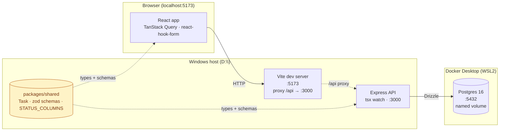
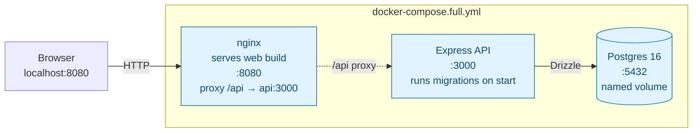
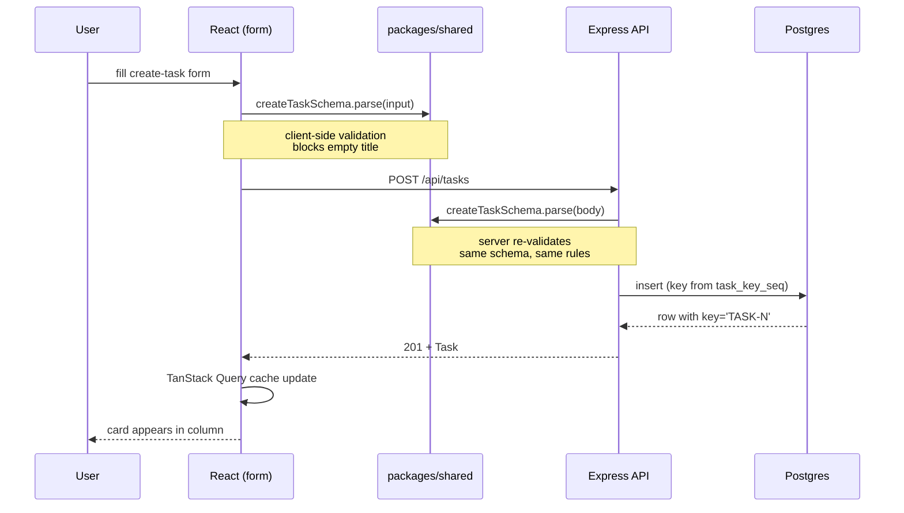
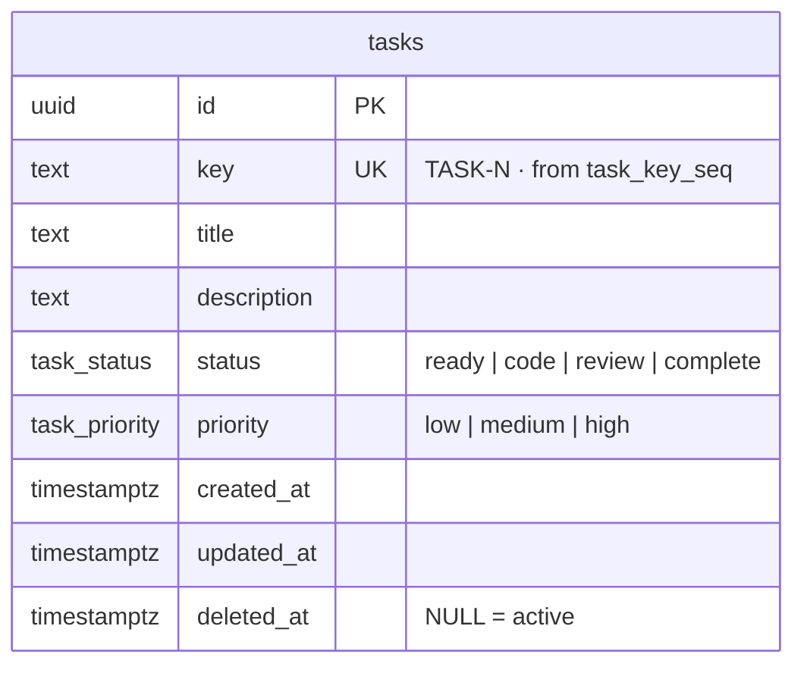

# Architecture

Runtime view of the service described in [build-plan.md](build-plan.md). The dependency graph in [execution-plan.md](execution-plan.md) covers *build order*; this doc covers *what runs where*.

Two topologies matter: development (M1–M5), where Postgres runs in Docker and the API/web run natively on Windows, and full-stack (M6), where everything is containerized.

---

## Development topology (M1–M5)

**Notes**

- `packages/shared` is imported by both apps — the same `createTaskSchema` validates in the browser (via `zodResolver`) and on the server (via middleware). Rename a status value there and both apps fail to compile. That is the M3 checkpoint.
- Vite's `/api` proxy is why there is no CORS config: from the browser's point of view, everything is same-origin on `:5173`.
- Postgres lives in a *named volume*, not a bind mount — that's the Windows/WSL2 performance rule from the setup section of the build plan.
- Reads go through a single `activeTasks()` helper that applies `where isNull(deleted_at)`. No route hand-writes the filter.

---

## Full-stack topology (M6)

**Notes**

- Multi-stage Dockerfiles build both apps; nginx serves the static web bundle.
- Source is `COPY`'d into images at build time — no hot-reload mount, so the Windows-filesystem penalty from the setup section does not apply here.
- The M6 checkpoint is `down -v` → `up --build` reaching a working app with no manual steps. Wiped volume is the actual test.

---

## Request lifecycle — creating a task

The point of the sequence: `createTaskSchema` is called twice, from the same source. That's the contract paying rent.

---

## Data shape

Single table. Soft delete via `deleted_at`. Status transitions are free-form — no workflow table, no state machine.
